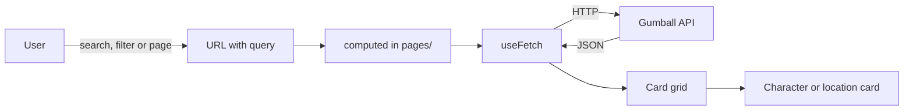
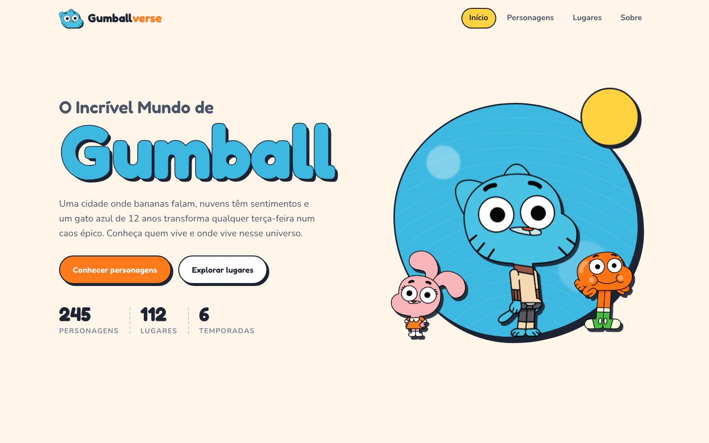
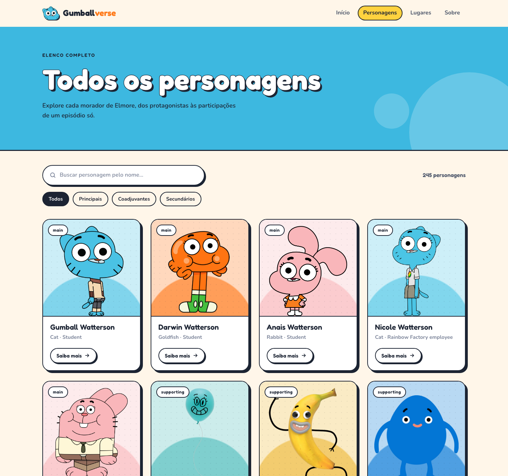
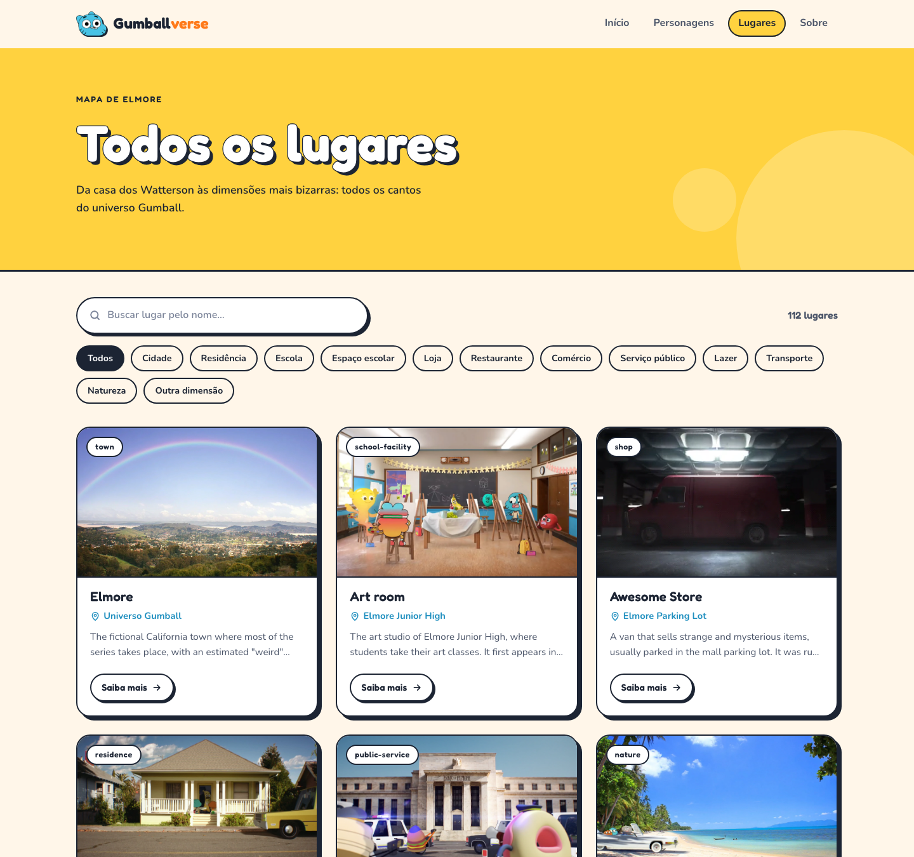
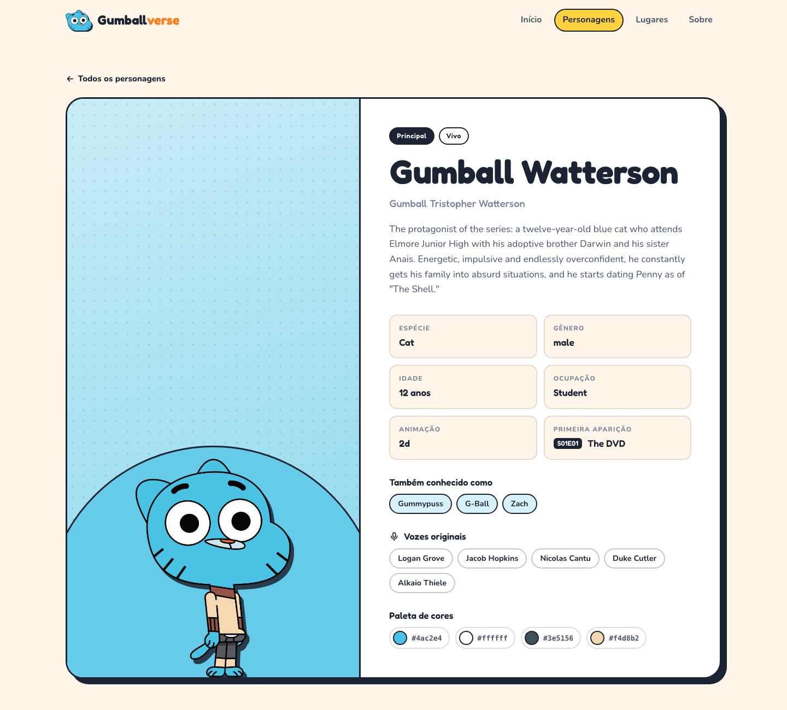
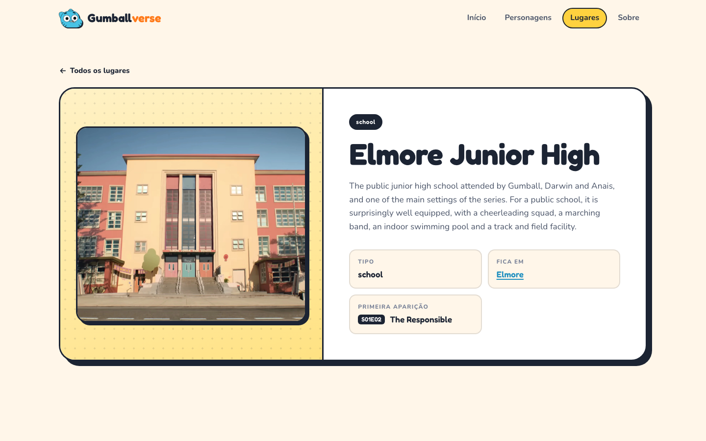
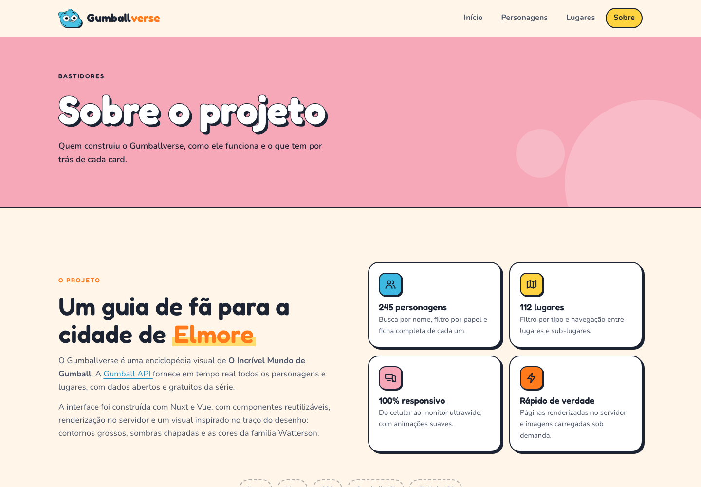
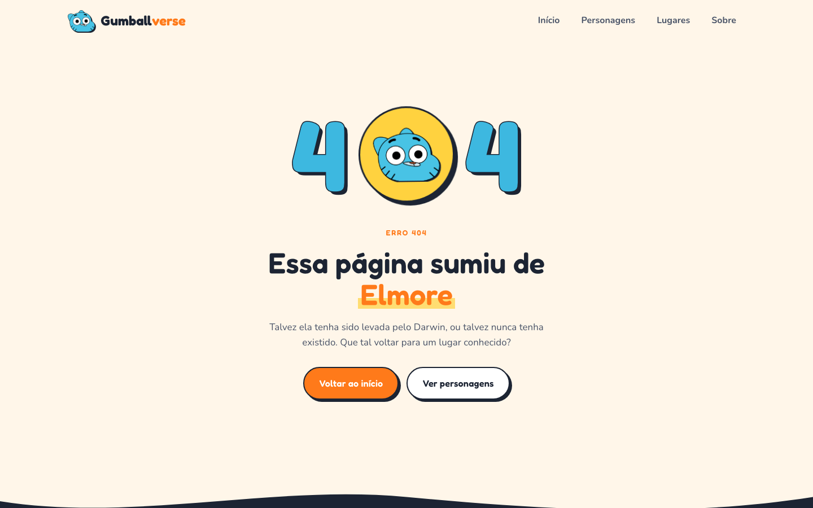

# Nuxt.js & Vue.js Workshop

[Português](README.md) | **English**

<table>
  <tr>
    <td width="800px">
      <div align="justify">
        This repository contains the hands-on material for the <b>Nuxt.js & Vue.js Workshop</b>, designed for people taking their first steps in the Vue ecosystem. The content is split into two parts: <b>Vue Basics</b>, with short, isolated examples of Vue fundamentals (interpolation, directives, reactivity, components, props, slots and events), and <b>Gumball Verse</b>, a complete <b>Nuxt</b> application inspired by <i>The Amazing World of Gumball</i>, which consumes the <a href="https://gumball-api.vercel.app/">Gumball API</a> and puts file-based routing, layouts, reusable components, data fetching and server-side rendering into practice.
      </div>
    </td>
    <td>
      <div align="center">
        
      </div>
    </td>
  </tr>
</table>

---

## 🚧 Project Status


[](#-license)


---

## 📚 Table of Contents

- [Project Status](#-project-status)
- [Workshop Materials](#-workshop-materials)
- [Useful Links](#-useful-links)
- [About the Project](#-about-the-project)
- [Main Features](#-main-features)
  - [Vue Basics](#-vue-basics)
  - [Gumball Verse](#-gumball-verse)
- [Technologies](#-technologies)
- [Architecture](#-architecture)
- [Installation and Usage](#-installation-and-usage)
  - [Prerequisites](#-prerequisites)
  - [Cloning the repository](#-cloning-the-repository)
  - [Running Vue Basics](#-running-vue-basics)
  - [Running Gumball Verse](#-running-gumball-verse)
  - [Customizing the About page](#-customizing-the-about-page)
- [Production Build](#-production-build)
- [Folder Structure](#-folder-structure)
- [Demo](#-demo)
- [References](#-references)
- [Author](#-author)
- [Contributing](#-contributing)
- [License](#-license)

---

## 🎓 Workshop Materials

The materials below accompany the workshop and complement the code in this repository.

<p align="left">
  <a href="https://app.notion.com/p/Workshop-de-Vue-js-e-Nuxt-js-b9936c7b4a0d44e598cb15c0f7c62b48"></a>
  <a href="https://drive.google.com/drive/u/0/folders/1JJddR_LQPA3B5hw_kr4rhRWjMT_6XoQw"></a>
</p>

| Material | Description |
| :--- | :--- |
| [**Supplementary material (Notion)**](https://app.notion.com/p/Workshop-de-Vue-js-e-Nuxt-js-b9936c7b4a0d44e598cb15c0f7c62b48) | Theoretical content of the workshop, explaining Vue and Nuxt concepts with examples and references for further study after the session. |
| [**Starter project (Google Drive)**](https://drive.google.com/drive/u/0/folders/1JJddR_LQPA3B5hw_kr4rhRWjMT_6XoQw) | The initial project participants receive to follow the hands-on part, with the layout ready and static data that will be integrated with the API during the workshop. |

---

## 🔗 Useful Links

- **Gumball API:** [gumball-api.vercel.app](https://gumball-api.vercel.app/), the free and open REST API that provides the characters and locations from the series.
- **Gumball API documentation:** [gumball-api.vercel.app/docs](https://gumball-api.vercel.app/docs), with every endpoint, filter and response format.
- **Vue documentation:** [vuejs.org](https://vuejs.org/guide/introduction.html), the official guide for the framework used in the first part of the workshop.
- **Nuxt documentation:** [nuxt.com/docs](https://nuxt.com/docs), the official guide for the framework used in the second part of the workshop.

---

## 📝 About the Project

The **Nuxt.js & Vue.js Workshop** was created to introduce modern front-end development with Vue in a practical, step-by-step way. Instead of jumping straight into a full framework, the workshop is split into two stages:

1. **Vue fundamentals (`vue-basics`):** each concept is presented in a small, standalone file, so participants can understand the structure of a `.vue` file, template syntax, directives and communication between components without the complexity of a real application.
2. **Real application with Nuxt (`gumball-verse`):** the same concepts are applied to a complete project, with multiple pages, a shared layout, a custom design system and data coming from a public API. This is where the features Nuxt adds on top of Vue come in: file-based routing, layouts, automatic component imports, `useFetch` and server-side rendering.

The chosen theme, **The Amazing World of Gumball**, makes learning lighter and more visual, and the [Gumball API](https://gumball-api.vercel.app/) provides real, varied data to practice listings, filters, pagination and detail pages.

The project can be used as support material during the workshop, as a reference for later study or as a starting point for anyone who wants to build their first Nuxt application.

---

## ✨ Main Features

### 🧩 Vue Basics

- **Expressions and interpolation:** using script variables inside the template with `{{ }}`.
- **Reactivity:** examples with `ref` and `computed`.
- **Directives:** `v-bind` (`:`), `v-on` (`@`), `v-if`, `v-for` and `v-model`.
- **Dynamic styles:** classes and styles applied according to state.
- **Components:** creating and using simple components, props (with and without `:`), slots and events emitted from child to parent.
- **Lifecycle:** example with `onMounted`.

### 🌐 Gumball Verse

- **Home page:** hero with an interactive carousel of the Watterson family and previews of characters and locations.
- **Character listing:** search by name, filter by role and pagination, with the state stored in the URL.
- **Location listing:** search by name, filter by type and pagination.
- **Detail pages:** full profile for each character (aliases, original voice actors and color palette) and for each location.
- **About page:** GitHub profile, contribution graph for the last year and the author's recent repositories.
- **Error page:** handling for 404 and API failures, with a themed look.
- **Custom design system:** color, typography and spacing tokens in vanilla CSS, with `scoped` styles per component.
- **Responsive layout:** from phones to ultrawide monitors, with a mobile menu and smooth animations.

---

## 🛠 Technologies

<p align="left">
  
</p>

| Technology                   | Version | Where it is used                                       |
| :--------------------------- | :------ | :----------------------------------------------------- |
| **Vue.js**                   | 3.5     | Foundation of both projects                            |
| **Nuxt**                     | 4.6     | Gumball Verse                                          |
| **Vite**                     | 8.3     | Vue Basics (development server and build)              |
| **TypeScript**               | 6.0     | Vue Basics configuration and Gumball Verse utilities   |
| **Vanilla CSS**              |         | Global design system and `scoped` styles per component |
| **Prettier**                 | 3       | Code formatting in both projects                       |
| **Gumball API**              |         | Character and location data                            |
| **GitHub REST API**          |         | Profile and repositories on the About page             |
| **GitHub Contributions API** |         | Contribution graph on the About page                   |

---

## 🏗 Architecture

**Vue Basics** is a Vue application built with Vite in which each file in the `src/` folder demonstrates a single concept. `App.vue` works as a showcase, importing the example components.

**Gumball Verse** follows Nuxt conventions:

- **`pages/`:** each file automatically becomes a route (`/characters`, `/characters/:id`, `/locations`, `/about`).
- **`layouts/`:** the default layout renders the header, the page content and the footer.
- **`components/`:** components organized by subject (`layout`, `common`, `home`, `character`, `location`, `details`, `about`, `icons`). The folders are only for organization, and components are imported automatically by name.
- **`composables/` and `utils/`:** reusable logic, such as the navigation links, choosing each character's color and formatting numbers and dates.
- **`assets/css/`:** the global design system, split into tokens, base, layout and interface elements.
- **`error.vue`:** a single page for 404 errors and API failures.

The data flow of the listing pages works like this:



Keeping the search, filter and page state in the URL makes the browser back button and link sharing work naturally, and `useFetch` automatically refetches whenever those values change.

---

## 🔧 Installation and Usage

### ✅ Prerequisites

- **Node.js:** version 22.18 or higher (recommended: 24 LTS)
- **npm:** installed together with Node.js
- **Git:** to clone the repository
- **Recommended editor:** VS Code with the [Vue (Official)](https://marketplace.visualstudio.com/items?itemName=Vue.volar) and [Prettier](https://marketplace.visualstudio.com/items?itemName=esbenp.prettier-vscode) extensions

The project does not need a database or environment variables.

To follow the hands-on part of the workshop, download the [starter project from Google Drive](https://drive.google.com/drive/u/0/folders/1JJddR_LQPA3B5hw_kr4rhRWjMT_6XoQw), which comes with the layout ready and static data. This repository contains the final version, with the API integration completed, and can be used as an answer key.

### 📦 Cloning the repository

```bash
git clone https://github.com/webtech-network/lab-nuxt-vue.git
cd lab-nuxt-vue
```

### 🧩 Running Vue Basics

```bash
cd vue-basics
npm install
npm run dev
```

The application is available at **http://localhost:5173**.

Each file in `src/` demonstrates one concept (`Expression.vue`, `Ref.vue`, `Computed.vue`, `VBind.vue`, `VOn.vue`, `VIf.vue`, `VFor.vue`, `VModel.vue`, `PaiEmit.vue`, among others). To see an example on screen, import and use the desired component in `App.vue`.

### 🌐 Running Gumball Verse

```bash
cd gumball-verse
npm install
npm run dev
```

The application is available at **http://localhost:3000**.

| Command            | Description                            |
| :----------------- | :------------------------------------- |
| `npm run dev`      | Starts the development server          |
| `npm run build`    | Creates the production build           |
| `npm run preview`  | Runs the production build locally      |
| `npm run generate` | Generates a static version of the site |
| `npm run format`   | Formats the code with Prettier         |

### 🐙 Customizing the About page

The About page shows the profile, contribution graph and repositories of a GitHub user. To display your own information, change the constant in `gumball-verse/app/pages/about/index.vue`:

```js
const GITHUB_USERNAME = "your-github-username";
```

The GitHub API allows 60 requests per hour per IP address without authentication. On shared networks, such as a workshop's, this limit can be reached quickly, and the page will show an error message until the limit resets.

---

## 🚀 Production Build

Gumball Verse can be deployed as an application with a Node.js server:

```bash
cd gumball-verse
npm run build
node .output/server/index.mjs
```

Or as a static site, compatible with Vercel, Netlify and GitHub Pages:

```bash
cd gumball-verse
npm run generate
```

The generated files are placed in `gumball-verse/.output/public`.

Vue Basics generates its static files in `vue-basics/dist`:

```bash
cd vue-basics
npm run build
```

---

## 📂 Folder Structure

```
.
├── LICENSE.md                    # ⚖️ Project MIT license
├── README.md                     # 📘 Documentation in Portuguese
├── README.en.md                  # 📘 Documentation in English
├── resources/                    # 🖼️ Screenshots used in the documentation
│
├── vue-basics/                   # 🧩 Vue fundamentals examples
│   ├── index.html                # 📄 Application base page
│   ├── vite.config.ts            # ⚙️ Vite configuration
│   ├── package.json              # 📦 Dependencies and scripts
│   └── src/
│       ├── main.ts               # 🚀 Application entry point
│       ├── App.vue               # 🧱 Examples showcase
│       ├── Expression.vue        # 🔤 Interpolation and expressions
│       ├── Ref.vue               # 🔁 Reactivity with ref
│       ├── Computed.vue          # 🧮 Derived values with computed
│       ├── VBind.vue             # 🔗 Dynamic attributes
│       ├── EstilosDinamicos.vue  # 🎨 Dynamic classes and styles
│       ├── VOn.vue               # 🖱️ Events
│       ├── VIf.vue               # 🔀 Conditional rendering
│       ├── VFor.vue              # 🔂 Lists
│       ├── ArrayObjetos.vue      # 📋 Lists of objects
│       ├── VModel.vue            # ⌨️ Forms with v-model
│       ├── PaiEmit.vue           # 📣 Events from child to parent
│       ├── onMounted.vue         # ⏱️ Lifecycle
│       └── components/           # 🧱 Example components (props, slots and emits)
│
└── gumball-verse/                # 🌐 Nuxt application
    ├── nuxt.config.ts            # ⚙️ Nuxt configuration (head, CSS and components)
    ├── package.json              # 📦 Dependencies and scripts
    ├── public/                   # 📂 Favicon and brand images
    └── app/
        ├── app.vue               # 🧱 Root component
        ├── error.vue             # 🚫 Error page (404 and API failures)
        ├── assets/css/           # 🎨 Design system (tokens, base, layout and UI)
        ├── layouts/              # 🖼️ Default layout with header and footer
        ├── pages/                # 📄 Application routes
        │   ├── index.vue         # 🏠 Home page
        │   ├── about/            # ℹ️ About page
        │   ├── characters/       # 🐱 Character listing and details
        │   └── locations/        # 🗺️ Location listing and details
        ├── components/           # 🧱 Components by subject
        │   ├── layout/           # Header, footer and logo
        │   ├── common/           # Card, badge, filters, pagination and more
        │   ├── home/             # Home page hero
        │   ├── character/        # Character cards, grids and details
        │   ├── location/         # Location cards, grids and details
        │   ├── details/          # Building blocks of the detail pages
        │   ├── about/            # About page sections
        │   └── icons/            # SVG icons
        ├── composables/          # 🎣 Reusable logic (navigation)
        └── utils/                # 🛠️ Utility functions (colors and formatting)
```

---

## 🎥 Demo

|                                    Home page                                    |                                 Character listing                                 |
| :-----------------------------------------------------------------------------: | :-------------------------------------------------------------------------------: |
|       |         |
|                              **Location listing**                               |                               **Character details**                               |
|         |  |
|                              **Location details**                               |                                  **About page**                                   |
|  |                     |
|                               **404 error page**                                |                                                                                   |
|           |                                                                                   |

---

## 📖 References

- **Vue.js:** [Official Vue guide](https://vuejs.org/guide/introduction.html)
- **Nuxt:** [Official Nuxt documentation](https://nuxt.com/docs)
- **Vite:** [Vite configuration guide](https://vite.dev/config/)
- **Gumball API:** [Gumball API documentation](https://gumball-api.vercel.app/docs)
- **GitHub REST API:** [GitHub REST API documentation](https://docs.github.com/en/rest)
- **Commits:** [Conventional Commits](https://www.conventionalcommits.org/en/v1.0.0/)

---

## 👥 Author

| 👤 Name              | 🖼️ Photo                                                                                                              | :octocat: GitHub                                                                                                                                                                                  | 💼 LinkedIn                                                                                                                                                                                                | 📤 Gmail                                                                                                                                                                                 |
| -------------------- | --------------------------------------------------------------------------------------------------------------------- | ------------------------------------------------------------------------------------------------------------------------------------------------------------------------------------------------- | ---------------------------------------------------------------------------------------------------------------------------------------------------------------------------------------------------------- | ---------------------------------------------------------------------------------------------------------------------------------------------------------------------------------------- |
| Artur Bomtempo Colen | <div align="center"></div> | <div align="center"><a href="https://github.com/arturbomtempo-dev"></a></div> | <div align="center"><a href="https://www.linkedin.com/in/artur-bomtempo/"></a></div> | <div align="center"><a href="mailto:arturbcolen@gmail.com"></a></div> |

---

## 🤝 Contributing

Suggestions and improvements are welcome. To contribute:

1. `Fork` the project.
2. Create a branch for your change (`git checkout -b feature/my-feature`).
3. Commit your changes following the [Conventional Commits](https://www.conventionalcommits.org/en/v1.0.0/) standard (`git commit -m 'feat: add new feature'`).
4. Push the branch (`git push origin feature/my-feature`).
5. Open a **Pull Request**.

---

## 📄 License

This project is distributed under the **[MIT License](LICENSE.md)**.
