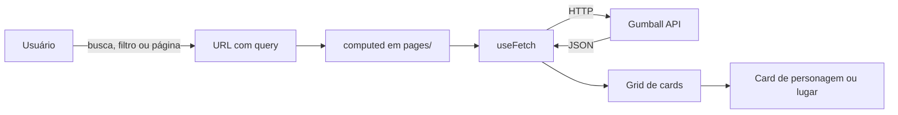

# Workshop de Nuxt.js & Vue.js

**Português** | [English](README.en.md)

<table>
  <tr>
    <td width="800px">
      <div align="justify">
        Este repositório reúne o material prático do <b>Workshop de Nuxt.js & Vue.js</b>, pensado para quem está dando os primeiros passos no ecossistema Vue. O conteúdo é dividido em duas partes: o <b>Vue Basics</b>, com exemplos curtos e isolados dos fundamentos do Vue (interpolação, diretivas, reatividade, componentes, props, slots e eventos), e o <b>Gumball Verse</b>, uma aplicação completa em <b>Nuxt</b> inspirada em <i>O Incrível Mundo de Gumball</i>, que consome a <a href="https://gumball-api.vercel.app/">Gumball API</a> e coloca em prática roteamento por arquivos, layouts, componentes reutilizáveis, busca de dados e renderização no servidor.
      </div>
    </td>
    <td>
      <div align="center">
        
      </div>
    </td>
  </tr>
</table>

---

## 🚧 Status do Projeto


[](#-licença)


---

## 📚 Índice

- [Status do Projeto](#-status-do-projeto)
- [Materiais do Workshop](#-materiais-do-workshop)
- [Links Úteis](#-links-úteis)
- [Sobre o Projeto](#-sobre-o-projeto)
- [Funcionalidades Principais](#-funcionalidades-principais)
  - [Vue Basics](#-vue-basics)
  - [Gumball Verse](#-gumball-verse)
- [Tecnologias Utilizadas](#-tecnologias-utilizadas)
- [Arquitetura](#-arquitetura)
- [Instalação e Execução](#-instalação-e-execução)
  - [Pré-requisitos](#-pré-requisitos)
  - [Clonando o repositório](#-clonando-o-repositório)
  - [Executando o Vue Basics](#-executando-o-vue-basics)
  - [Executando o Gumball Verse](#-executando-o-gumball-verse)
  - [Personalizando a página Sobre](#-personalizando-a-página-sobre)
- [Build para Produção](#-build-para-produção)
- [Estrutura de Pastas](#-estrutura-de-pastas)
- [Demonstração](#-demonstração)
- [Documentações Utilizadas](#-documentações-utilizadas)
- [Autor](#-autor)
- [Contribuição](#-contribuição)
- [Licença](#-licença)

---

## 🎓 Materiais do Workshop

Os materiais abaixo acompanham o workshop e complementam o código deste repositório.

<p align="left">
  <a href="https://app.notion.com/p/Workshop-de-Vue-js-e-Nuxt-js-b9936c7b4a0d44e598cb15c0f7c62b48"></a>
  <a href="https://drive.google.com/drive/u/0/folders/1JJddR_LQPA3B5hw_kr4rhRWjMT_6XoQw"></a>
</p>

| Material | Descrição |
| :--- | :--- |
| [**Material complementar (Notion)**](https://app.notion.com/p/Workshop-de-Vue-js-e-Nuxt-js-b9936c7b4a0d44e598cb15c0f7c62b48) | Conteúdo teórico do workshop, com a explicação dos conceitos de Vue e Nuxt, exemplos e referências para estudar depois do encontro. |
| [**Base do projeto (Google Drive)**](https://drive.google.com/drive/u/0/folders/1JJddR_LQPA3B5hw_kr4rhRWjMT_6XoQw) | Projeto inicial que os participantes recebem para acompanhar a parte prática, com o layout pronto e os dados estáticos que serão integrados à API durante o workshop. |

---

## 🔗 Links Úteis

- **Gumball API:** [gumball-api.vercel.app](https://gumball-api.vercel.app/), a API REST gratuita e aberta que fornece os personagens e lugares da série.
- **Documentação da Gumball API:** [gumball-api.vercel.app/docs](https://gumball-api.vercel.app/docs), com todos os endpoints, filtros e formatos de resposta.
- **Documentação do Vue:** [vuejs.org](https://vuejs.org/guide/introduction.html), o guia oficial do framework usado na primeira parte do workshop.
- **Documentação do Nuxt:** [nuxt.com/docs](https://nuxt.com/docs), o guia oficial do framework usado na segunda parte do workshop.

---

## 📝 Sobre o Projeto

O **Workshop de Nuxt.js & Vue.js** foi criado para apresentar o desenvolvimento front-end moderno com Vue de forma prática e progressiva. Em vez de começar direto por um framework completo, o workshop é dividido em duas etapas:

1. **Fundamentos do Vue (`vue-basics`):** cada conceito é apresentado em um arquivo pequeno e independente, para que os participantes entendam a estrutura de um arquivo `.vue`, a sintaxe do template, as diretivas e a comunicação entre componentes, sem a complexidade de uma aplicação real.
2. **Aplicação real com Nuxt (`gumball-verse`):** os mesmos conceitos são aplicados em um projeto completo, com várias páginas, layout compartilhado, design system próprio e dados vindos de uma API pública. Aqui entram os recursos que o Nuxt adiciona ao Vue: rotas baseadas em arquivos, layouts, importação automática de componentes, `useFetch` e renderização no servidor.

O tema escolhido, **O Incrível Mundo de Gumball**, deixa o aprendizado mais leve e visual, e a [Gumball API](https://gumball-api.vercel.app/) oferece dados reais e variados para praticar listagens, filtros, paginação e páginas de detalhe.

O projeto pode ser usado como material de apoio durante o workshop, como referência para estudos posteriores ou como ponto de partida para quem quer criar a sua primeira aplicação com Nuxt.

---

## ✨ Funcionalidades Principais

### 🧩 Vue Basics

- **Expressões e interpolação:** uso de variáveis do script dentro do template com `{{ }}`.
- **Reatividade:** exemplos com `ref` e `computed`.
- **Diretivas:** `v-bind` (`:`), `v-on` (`@`), `v-if`, `v-for` e `v-model`.
- **Estilos dinâmicos:** classes e estilos aplicados de acordo com o estado.
- **Componentes:** criação e uso de componentes simples, props (com e sem `:`), slots e eventos emitidos do filho para o pai.
- **Ciclo de vida:** exemplo com `onMounted`.

### 🌐 Gumball Verse

- **Página inicial:** hero com carrossel interativo da família Watterson e prévias de personagens e lugares.
- **Listagem de personagens:** busca por nome, filtro por papel e paginação, com o estado guardado na URL.
- **Listagem de lugares:** busca por nome, filtro por tipo e paginação.
- **Páginas de detalhe:** ficha completa de cada personagem (apelidos, vozes originais e paleta de cores) e de cada lugar.
- **Página Sobre:** perfil do GitHub, gráfico de contribuições do último ano e repositórios recentes do autor.
- **Página de erro:** tratamento de 404 e de falhas da API, com visual temático.
- **Design system próprio:** tokens de cor, tipografia e espaçamento em CSS puro, com estilos `scoped` por componente.
- **Layout responsivo:** do celular ao monitor ultrawide, com menu mobile e animações suaves.

---

## 🛠 Tecnologias Utilizadas

<p align="left">
  
</p>

| Tecnologia                   | Versão | Onde é usada                                              |
| :--------------------------- | :----- | :-------------------------------------------------------- |
| **Vue.js**                   | 3.5    | Base dos dois projetos                                    |
| **Nuxt**                     | 4.6    | Gumball Verse                                             |
| **Vite**                     | 8.3    | Vue Basics (servidor de desenvolvimento e build)          |
| **TypeScript**               | 6.0    | Configuração do Vue Basics e utilitários do Gumball Verse |
| **CSS puro**                 |        | Design system global e estilos `scoped` por componente    |
| **Prettier**                 | 3      | Formatação de código nos dois projetos                    |
| **Gumball API**              |        | Dados de personagens e lugares                            |
| **GitHub REST API**          |        | Perfil e repositórios na página Sobre                     |
| **GitHub Contributions API** |        | Gráfico de contribuições na página Sobre                  |

---

## 🏗 Arquitetura

O **Vue Basics** é uma aplicação Vue com Vite em que cada arquivo da pasta `src/` demonstra um único conceito. O `App.vue` funciona como vitrine, importando os componentes de exemplo.

O **Gumball Verse** segue as convenções do Nuxt:

- **`pages/`:** cada arquivo vira uma rota automaticamente (`/characters`, `/characters/:id`, `/locations`, `/about`).
- **`layouts/`:** o layout padrão monta o header, o conteúdo da página e o rodapé.
- **`components/`:** componentes organizados por assunto (`layout`, `common`, `home`, `character`, `location`, `details`, `about`, `icons`). As pastas servem apenas para organização, e os componentes são importados automaticamente pelo nome.
- **`composables/` e `utils/`:** lógica reutilizável, como os links de navegação, a escolha de cor dos personagens e a formatação de números e datas.
- **`assets/css/`:** o design system global, dividido em tokens, base, layout e elementos de interface.
- **`error.vue`:** página única para erros 404 e falhas da API.

O fluxo de dados das páginas de listagem é o seguinte:



Guardar o estado da busca, do filtro e da página na URL permite que o botão voltar do navegador e o compartilhamento de links funcionem naturalmente, e o `useFetch` refaz a requisição sozinho sempre que esses valores mudam.

---

## 🔧 Instalação e Execução

### ✅ Pré-requisitos

- **Node.js:** versão 22.18 ou superior (recomendado: 24 LTS)
- **npm:** instalado junto com o Node.js
- **Git:** para clonar o repositório
- **Editor recomendado:** VS Code com as extensões [Vue (Official)](https://marketplace.visualstudio.com/items?itemName=Vue.volar) e [Prettier](https://marketplace.visualstudio.com/items?itemName=esbenp.prettier-vscode)

O projeto não precisa de banco de dados nem de variáveis de ambiente.

Para acompanhar a parte prática do workshop, baixe a [base do projeto no Google Drive](https://drive.google.com/drive/u/0/folders/1JJddR_LQPA3B5hw_kr4rhRWjMT_6XoQw), que já vem com o layout pronto e os dados estáticos. Este repositório contém a versão final, com a integração à API concluída, e pode ser usado como gabarito.

### 📦 Clonando o repositório

```bash
git clone https://github.com/webtech-network/lab-nuxt-vue.git
cd lab-nuxt-vue
```

### 🧩 Executando o Vue Basics

```bash
cd vue-basics
npm install
npm run dev
```

A aplicação fica disponível em **http://localhost:5173**.

Cada arquivo em `src/` demonstra um conceito (`Expression.vue`, `Ref.vue`, `Computed.vue`, `VBind.vue`, `VOn.vue`, `VIf.vue`, `VFor.vue`, `VModel.vue`, `PaiEmit.vue`, entre outros). Para ver um exemplo na tela, importe e use o componente desejado no `App.vue`.

### 🌐 Executando o Gumball Verse

```bash
cd gumball-verse
npm install
npm run dev
```

A aplicação fica disponível em **http://localhost:3000**.

| Comando            | Descrição                              |
| :----------------- | :------------------------------------- |
| `npm run dev`      | Inicia o servidor de desenvolvimento   |
| `npm run build`    | Gera o build de produção               |
| `npm run preview`  | Executa localmente o build de produção |
| `npm run generate` | Gera uma versão estática do site       |
| `npm run format`   | Formata o código com o Prettier        |

### 🐙 Personalizando a página Sobre

A página Sobre mostra o perfil, o gráfico de contribuições e os repositórios de um usuário do GitHub. Para exibir as suas próprias informações, altere a constante no arquivo `gumball-verse/app/pages/about/index.vue`:

```js
const GITHUB_USERNAME = "seu-usuario-do-github";
```

A API do GitHub permite 60 requisições por hora por endereço IP sem autenticação. Em redes compartilhadas, como a de um workshop, esse limite pode ser atingido rapidamente, e a página passa a exibir uma mensagem de erro até o limite ser renovado.

---

## 🚀 Build para Produção

O Gumball Verse pode ser publicado como aplicação com servidor Node.js:

```bash
cd gumball-verse
npm run build
node .output/server/index.mjs
```

Ou como site estático, compatível com Vercel, Netlify e GitHub Pages:

```bash
cd gumball-verse
npm run generate
```

Os arquivos gerados ficam em `gumball-verse/.output/public`.

O Vue Basics gera os arquivos estáticos em `vue-basics/dist`:

```bash
cd vue-basics
npm run build
```

---

## 📂 Estrutura de Pastas

```
.
├── LICENSE.md                    # ⚖️ Licença MIT do projeto
├── README.md                     # 📘 Documentação em português
├── README.en.md                  # 📘 Documentação em inglês
├── resources/                    # 🖼️ Capturas de tela usadas na documentação
│
├── vue-basics/                   # 🧩 Exemplos dos fundamentos do Vue
│   ├── index.html                # 📄 Página base da aplicação
│   ├── vite.config.ts            # ⚙️ Configuração do Vite
│   ├── package.json              # 📦 Dependências e scripts
│   └── src/
│       ├── main.ts               # 🚀 Ponto de entrada da aplicação
│       ├── App.vue               # 🧱 Vitrine dos exemplos
│       ├── Expression.vue        # 🔤 Interpolação e expressões
│       ├── Ref.vue               # 🔁 Reatividade com ref
│       ├── Computed.vue          # 🧮 Valores derivados com computed
│       ├── VBind.vue             # 🔗 Atributos dinâmicos
│       ├── EstilosDinamicos.vue  # 🎨 Classes e estilos dinâmicos
│       ├── VOn.vue               # 🖱️ Eventos
│       ├── VIf.vue               # 🔀 Renderização condicional
│       ├── VFor.vue              # 🔂 Listas
│       ├── ArrayObjetos.vue      # 📋 Listas de objetos
│       ├── VModel.vue            # ⌨️ Formulários com v-model
│       ├── PaiEmit.vue           # 📣 Eventos do filho para o pai
│       ├── onMounted.vue         # ⏱️ Ciclo de vida
│       └── components/           # 🧱 Componentes de exemplo (props, slots e emits)
│
└── gumball-verse/                # 🌐 Aplicação Nuxt
    ├── nuxt.config.ts            # ⚙️ Configuração do Nuxt (head, CSS e componentes)
    ├── package.json              # 📦 Dependências e scripts
    ├── public/                   # 📂 Favicon e imagens da marca
    └── app/
        ├── app.vue               # 🧱 Componente raiz
        ├── error.vue             # 🚫 Página de erro (404 e falhas da API)
        ├── assets/css/           # 🎨 Design system (tokens, base, layout e UI)
        ├── layouts/              # 🖼️ Layout padrão com header e rodapé
        ├── pages/                # 📄 Rotas da aplicação
        │   ├── index.vue         # 🏠 Página inicial
        │   ├── about/            # ℹ️ Página Sobre
        │   ├── characters/       # 🐱 Listagem e detalhe de personagens
        │   └── locations/        # 🗺️ Listagem e detalhe de lugares
        ├── components/           # 🧱 Componentes por assunto
        │   ├── layout/           # Header, rodapé e logo
        │   ├── common/           # Card, badge, filtros, paginação e afins
        │   ├── home/             # Hero da página inicial
        │   ├── character/        # Cards, grids e detalhes de personagens
        │   ├── location/         # Cards, grids e detalhes de lugares
        │   ├── details/          # Peças das páginas de detalhe
        │   ├── about/            # Seções da página Sobre
        │   └── icons/            # Ícones SVG
        ├── composables/          # 🎣 Lógica reutilizável (navegação)
        └── utils/                # 🛠️ Funções utilitárias (cores e formatação)
```

---

## 🎥 Demonstração

|                                   Página inicial                                   |                                Listagem de personagens                                |
| :--------------------------------------------------------------------------------: | :-----------------------------------------------------------------------------------: |
|  |       |
|                              **Listagem de lugares**                               |                               **Detalhe de personagem**                               |
|         |  |
|                                **Detalhe de lugar**                                |                                   **Página Sobre**                                    |
|     |                       |
|                               **Página de erro 404**                               |                                                                                       |
|          |                                                                                       |

---

## 📖 Documentações Utilizadas

- **Vue.js:** [Guia oficial do Vue](https://vuejs.org/guide/introduction.html)
- **Nuxt:** [Documentação oficial do Nuxt](https://nuxt.com/docs)
- **Vite:** [Guia de configuração do Vite](https://vite.dev/config/)
- **Gumball API:** [Documentação da Gumball API](https://gumball-api.vercel.app/docs)
- **GitHub REST API:** [Documentação da API REST do GitHub](https://docs.github.com/en/rest)
- **Commits:** [Conventional Commits](https://www.conventionalcommits.org/en/v1.0.0/)

---

## 👥 Autor

| 👤 Nome              | 🖼️ Foto                                                                                                               | :octocat: GitHub                                                                                                                                                                                  | 💼 LinkedIn                                                                                                                                                                                                | 📤 Gmail                                                                                                                                                                                 |
| -------------------- | --------------------------------------------------------------------------------------------------------------------- | ------------------------------------------------------------------------------------------------------------------------------------------------------------------------------------------------- | ---------------------------------------------------------------------------------------------------------------------------------------------------------------------------------------------------------- | ---------------------------------------------------------------------------------------------------------------------------------------------------------------------------------------- |
| Artur Bomtempo Colen | <div align="center"></div> | <div align="center"><a href="https://github.com/arturbomtempo-dev"></a></div> | <div align="center"><a href="https://www.linkedin.com/in/artur-bomtempo/"></a></div> | <div align="center"><a href="mailto:arturbcolen@gmail.com"></a></div> |

---

## 🤝 Contribuição

Sugestões e melhorias são bem-vindas. Para contribuir:

1. Faça um `fork` do projeto.
2. Crie uma branch para a sua alteração (`git checkout -b feature/minha-feature`).
3. Faça o commit das mudanças seguindo o padrão [Conventional Commits](https://www.conventionalcommits.org/en/v1.0.0/) (`git commit -m 'feat: adiciona nova funcionalidade'`).
4. Envie a branch (`git push origin feature/minha-feature`).
5. Abra um **Pull Request**.

---

## 📄 Licença

Este projeto é distribuído sob a **[Licença MIT](LICENSE.md)**.
